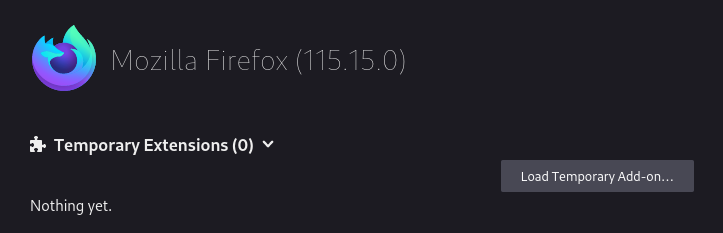

# Maziaj Everywhere
A browser extension that puts maziaj on every page (in theory)
---

## Installation

## Development Workflow
### Firefox
To load addon from files in Firefox, you need to go to `about:debugging#/runtime/this-firefox` and click `Load Temporary Add-on...`. After that you need to select manifest.json file in file picker. 

### Chrome
To load extension from files in Chrome, you need to go to `chrome://extensions/` and click `Load unpacked` (with developer mode enabled) 

